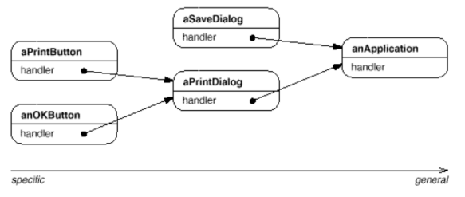
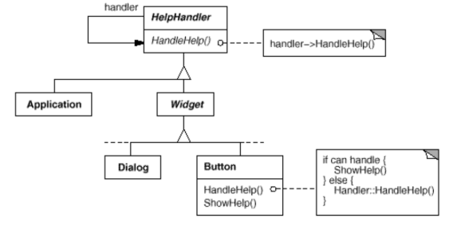
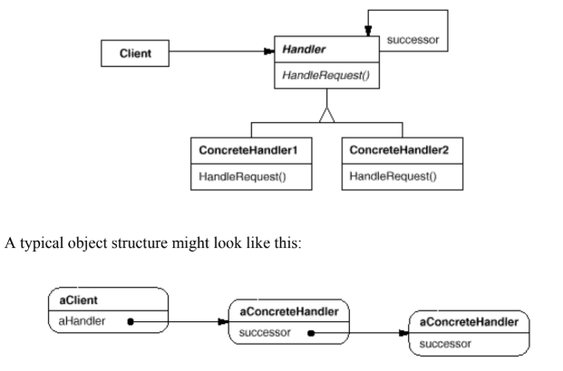

# Chain of Responsibility

### Intent

Avoid coupling the sender of a request to its receiver by giving more than one object a chance to handle the request.

Chain the receiving objects and pass the request along the chain until an object handles it.

### Applicability

Use _Chain of Responsibility_ when:
* More than one object may handle a request, and the handler isn't known a priori. Handler should be ascertained automatically.
* You want to issue a request to one of several objects without specifying the receiver explicitly.
* Set of objects that can handle a request should be specified dynamically.

### Motivation

Consider a context-sensitive help facility for a graphical user interface. The user can obtain help information on any part of the interface just by clicking on it. The help that's provided depends on the part of the interface that's selected and its context; for example, a button widget in a dialog box might have different help information than a similar button in the main window. If no specific help information exists for that part of the interface, then the help system should display a more general help message about the immediate context—the dialog box as a whole, for example.

Hence it's natural to organize help information according to its generality—from the most specific to the most general. Furthermore, it's clear that a help request is handled by one of several user interface objects; which one depends on the context and how specific the available help is.

The problem here is that the object that ultimately provides the help isn't known explicitly to the object (e.g., the button) that initiates the help request. What we need is a way to decouple the button that initiates the help request from the objects that might provide help information. The Chain of Responsibility pattern defines how that happens.

The idea of this pattern is to decouple senders and receivers by giving multiple objects a chance to handle a request. The request gets passed along a chain of objects until one of them handles it.

The first object in the chain receives the request and either handles it or forwards it to the next candidate on the chain, which does likewise. The object that made the request has no explicit knowledge of who will handle it—we say the request has an implicit receiver.

To forward the request along the chain, and to ensure receivers remain implicit, each object on the chain shares a common interface for handling requests and for accessing its successor on the chain. For example, the help system might define a HelpHandler class with a corresponding HandleHelp operation. HelpHandler can be the parent class for candidate object classes, or it can be defined as a mixin class. Then classes that want to handle help requests can make HelpHandler a parent:

### Structure

### Consequences

1. _Reduced coupling_. An object only has to know that a request will be handled "appropriately". 
2. _Added flexibility in assigning responsibilities to objects_.
3. _Recepit isn't guaranteed_. Request can fall off the end of the chain without ever being handled. 