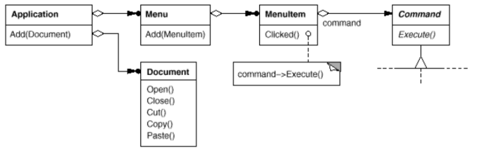
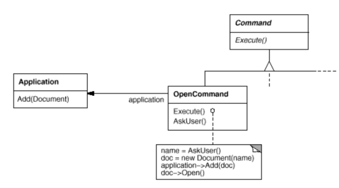
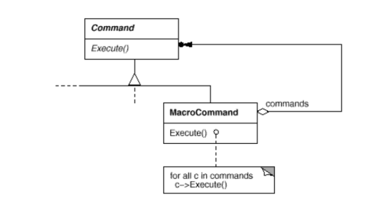
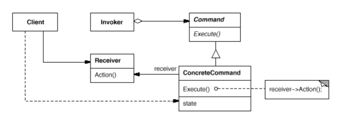

# Command

Also known as __Action__, __Transaction__.

### Intent

Encapsulate a request as an object, thereby letting you parameterize clients with different requests, queue or log requests, and support undoable operations.

### Applicability

Use the __Command__ pattern when you want to:
* Parameterize objects by an action to perform. Commands are an object-oriented replacement for callbacks of procedural languages.
* Specify, queue, and execute requests at different times.
* Support undo.
* Support logging changes.
* Structure a system around high-level operations built on primitive operations. Such a structure is common in information systems that support __transactions__.

### Motivation

Sometimes it's necessary to issue requests to objects without knowing anything about the operation being requested or the receiver of the request. For example, user interface toolkits include objects like buttons and menus that carry out a request in response to user input. But the toolkit can't implement the request explicitly in the button or menu, because only applications that use the toolkit know what should be done on which object. As toolkit designers we have no way of knowing the receiver of the request or the operations that will carry it out.

The Command pattern lets toolkit objects make requests of unspecified application objects by turning the request itself into an object. This object can be stored and passed around like other objects. The key to this pattern is an abstract Command class, which declares an interface for executing operations. In the simplest form this interface includes an abstract Execute operation. Concrete Command subclasses specify a receiver-action pair by storing the receiver as an instance variable and by implementing Execute to invoke the request. The receiver has the knowledge required to carry out the request.

### Structure

### Consequences

1. Command decouples the object that invokes the operation from the one that knows how to perform it.
2. Commands are first-class objects. They can be manipulated and extended like any other object.
3. You can assemble commands into a composite command (_Macro commands_).
4. It's easy to add new Commands, becase you don't have to change existing classes.