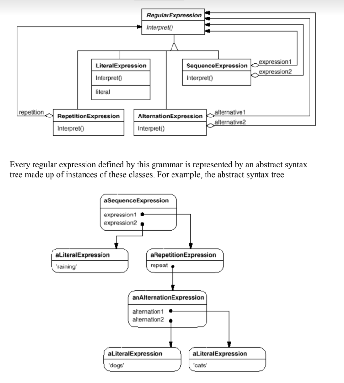

# Interpreter

### Intent

Given a language, define a representation for its grammar along with an interpreter that uses the representation to interpret sentences in the language.we

### Applicability

Use the __Interpreter__ pattern when there is a language to interpret, and you can represent statements in the language as abstract syntax trees. The Interpreter pattern works best when:

* Grammar is simple. For complex grammars, class hierarchies becomes large and unmanageable. Toos such as parser generators are a better alternative in such cases.
* Efficiency is not a critical concern. The most efficient interpreters are usually not implemented by interpreting parse trees directly but by first translating them into another form.

### Motivation

If a particular kind of problem occurs often enough, then it might be worthwhile to express instances of the problem as sentences in a simple language. Then you can build an interpreter that solves the problem by interpreting these sentences.

For example, searching for strings that match a pattern is a common problem. Regular expressions are a standard language for specifying patterns of strings. Rather than building custom algorithms to match each pattern against strings, search algorithms could interpret a regular expression that specifies a set of strings to match. 

The Interpreter pattern describes how to define a grammar for simple languages, represent sentences in the language, and interpret these sentences. In this example, the pattern describes how to define a grammar for regular expressions, represent a particular regular expression, and how to interpret that regular expression.

### Structure

### Consequences

1. It's easy to change and extend the grammar.
2. Implemting the grammar is easy.
3. Complex grammars are hard to maintain.
4. Adding new ways to interpret expressons is easy.