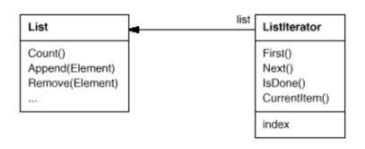
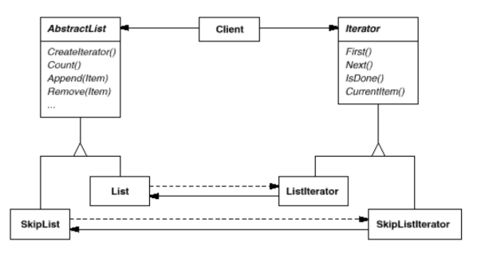
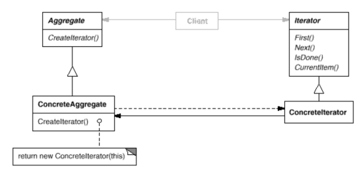

# Interpreter

Also known as __Cursor__.

### Intent

Provide a way to access the elements of an aggregate object sequentially without exposing its underlying representation.

### Applicability

Use the __Iterator__ pattern:
* To access an aggregate object's contents without exposing its internal representation.
* To support multiple traversals of aggregate objects.
* To provide a uniform interface for traversing different aggregate structures (polymorphic iteration).

### Motivation

An aggregate object such as a list should give you a way to access its elements without exposing its internal structure. Moreover, you might want to traverse the list in different ways, depending on what you want to accomplish. But you probably don't want to bloat the List interface with operations for different traversals, even if you could anticipate the ones you will need. You might also need to have more than one traversal pending on the same list.

The Iterator pattern lets you do all this. The key idea in this pattern is to take the responsibility for access and traversal out of the list object and put it into an iterator object. The Iterator class defines an interface for accessing the list's elements. An iterator object is responsible for keeping track of the current element; that is, it knows which elements have been traversed already.

y

Separating the traversal mechanism from the List object lets us define iterators for different traversal policies without enumerating them in the List interface. For example, FilteringListIterator might provide access only to those elements that satisfy specific filtering constraints.

Notice that the iterator and the list are coupled, and the client must know that it is a list that's traversed as opposed to some other aggregate structure. Hence the client commits to a particular aggregate structure. It would be better if we could change the aggregate class without changing client code. We can do this by generalizing the iterator concept to support polymorphic iteration.

The remaining problem is how to create the iterator. Since we want to write code that's independent of the concrete List subclasses, we cannot simply instantiate a specific class. Instead, we make the list objects responsible for creating their corresponding iterator. This requires an operation like CreateIterator through which clients request an iterator object.

### Structure

### Consequences

1. It supports variations in the traversal of an aggregate.
2. Iterators simplify the Aggregate interface.
3. More than one traversal can be pending on an aggregate.