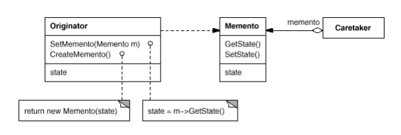
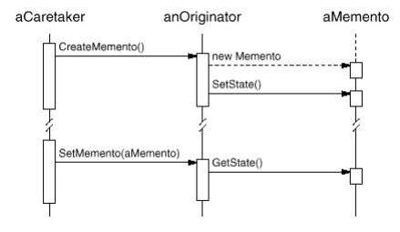

# Memento

Also kwown as __Token__.

### Intent

Without violating encapsulation, capture and externalize an object's internal state so that the object can be restored to this state later.

### Applicability

Use the __Memento__ pattern when:
* A snapshot of an object's state must be saved so that it can be restored later, _and_
* A direct interface to obtaining the state would expose implementation details and break the object's encapsulation.

### Motivation

Sometimes it's necessary to record the internal state of an object. This is required when implementing checkpoints and undo mechanisms that let users back out of tentative operations or recover from errors. You must save state information somewhere so that you can restore objects to their previous states. But objects normally encapsulate some or all of their state, making it inaccessible to other objects and impossible to save externally. Exposing this state would violate encapsulation, which can compromise the application's reliability and extensibility. 

A memento is an object that stores a snapshot of the internal state of another object—the __memento's Originator__. The undo mechanism will request a memento from the originator when it needs to checkpoint the originator's state. The originator initializes the memento with information that characterizes its current state. __Only the originator can store and retrieve information from the memento—the memento is "opaque" to other objects__. 

### Structure

### Consequences

1. Preserving encapsultion boundaries.
2. Simplifies Originator. Having clients manage the state they ask for simplifies Originator.
3. Using mementos might be expensive. Unless encapsulating and restoring Originator state is cheap, this pattern might not be appropriate.
4. Hidden costs in caring for mementos. 
