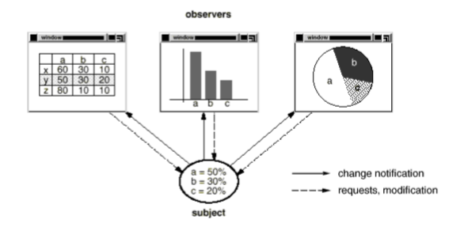
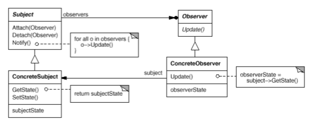

# Observer

Also known as _Dependents_, _Publisher-Subscribe_.

### Intent

Define a one-to-many dependency between objects so that when object changes state, all its dependents are notified and updated automatically.

### Applicability

Use the __Observer__ pattern in any of the following situations:
* An abstraction has two aspects, one dependent on the other. Encapsulating these aspects in separate objects lets you vary and reuse them independently.
* When a change to one object requires changing others, and you don't know how many objects need to be changed.
* When an object should be able to notify other objects without making assumptions about who these objets are.

### Motivation

A common side-effect of partitioning a system into a collection of cooperating classes is the need to maintain consistency between related objects. You don't want to achieve consistency by making the classes tightly coupled, because that reduces their reusability.

For example, many graphical user interface toolkits separate the presentational aspects of the user interface from the underlying application data. Classes defining application data and presentations can be reused independently. They can work together, too. Both a spreadsheet object and bar chart object can depict information in the same application data object using different presentations. The spreadsheet and the bar chart don't know about each other, thereby letting you reuse only the one you need. But they behave as though they do. When the user changes the information in the spreadsheet, the bar chart reflects the changes immediately, and vice versa. 
 

This behavior implies that the spreadsheet and bar chart are dependent on the data object and therefore should be notified of any change in its state.

The Observer pattern describes how to establish these relationships. The key objects in this pattern are __subject and observer__. A subject may have any number of dependent observers. __All observers are notified whenever the subject undergoes a change in state. In response, each observer will query the subject to synchronize its state with the subject's state__.

This kind of interaction is also known as __publish-subscribe__. The subject is the publisher of notifications. It sends out these notifications without having to know who its observers are. Any number of observers can subscribe to receive notifications. 

### Structure

### Consequences

1. Proxy introduces a level of indirection when accessing an object. Depending on the type of Proxy the indirection has many uses.
    * Remote proxy can hide the fact that an object resides in a different address space.
    * Virtual proxy can perform optimizations such as creating object on demand.
    * Both Protection proxy and Smart references allow additional housekeeping tasks when an object is accessed.
2. Optimizations like __Copy-on-Write__ can be hidden from the client. Copying a large and complicated object can be an expensive operation. If the copy is never modified then there's no need to incur this cost. By using a proxy to postpone the copying process, we ensure that we pay the price of copying the objecto nly if it's modified.