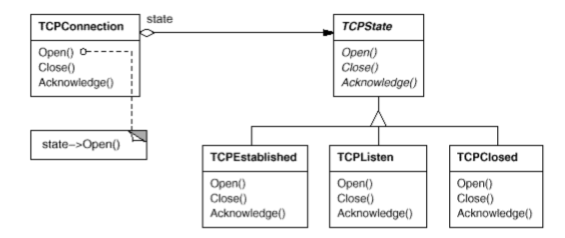
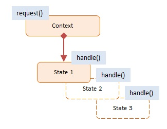
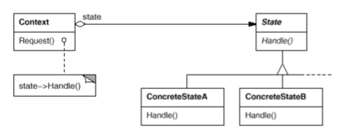

# State

### Intent

Allow an object to alter its behavior when its internal state changes. The object will appear to change its class.

### Applicability

Use the __State__ pattern in either of the following cases:
* An object's behavior depends on its state, and it must change its behavior at runtime dependending on that sate.
* Operations have large, multipart conditional statements that depend on the object's state. The State pattern puts each branch of the conditional in a separate class.

### Motivation

Consider a class TCPConnection that represents a network connection. A TCPConnection object can be in one of several different states: Established, Listening, Closed. When a TCPConnection object receives requests from other objects, it responds differently depending on its current state. For example, the effect of an Open request depends on whether the connection is in its Closed state or its Established state. The State pattern describes how TCPConnection can exhibit different behavior in each state. 

The class TCPConnection maintains a state object (an instance of a subclass of TCPState) that represents the current state of the TCP connection. The class TCPConnection delegates all state-specific requests to this state object. TCPConnection uses its TCPState subclass instance to perform operations particular to the state of the connection. 

### Structure

### Consequences

1. It localizes state-specific behavior and partitions behavior for different states.
2. It makes state transitions explicit.
3. State objects can be shared.