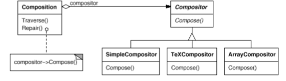
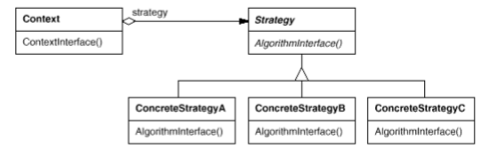

# Strategy

Also known as __Policy__.

### Intent

Define a family of algorithms, encapsulate each one, and make them interchangeable. Strategy lets the algorithm vary independently from clients that use it.

### Applicability

Use the __Strategy__ pattern when:
* Many related classes differ only in their behavior. Strategies provide a way to configure one class, with one of many behaviors.
* You need different variants of an algorithm. For example, reflecting different space/time trade-offs.
* An algorithm uses data that clients shouldn't know about. Strategy pattern helps you avoid exposing complex, algorithm-specific data structures.
* A class defines many behaviors, and these appear as multiple conditional statements in its operations.

### Motivation

Hard-wiring some algorithms into the classes that require them isn't desirable for several reasons:
* Clients that require this algorithm get bigger and harder to maintain.
* Different algorithms will be appropriate at different times. We don't want to support them all if we don't use them.
* It's difficult to add new algorithms and vary existing ones when they are an integral part of a client.

We can avoid these problems by defining classes that encapsulates different algorithms. An algorithm that's encapsulated in this way is called a __Strategy__.

### Structure

### Consequences

1. Families of related algorithms.
2. An alternative to subclassing.
3. Strategies eliminate conditional statements.
4. Clients must be ware of different Strategies.
5. Communication overhead between Strategy and Context.
6. Increased number of objects.