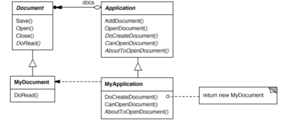
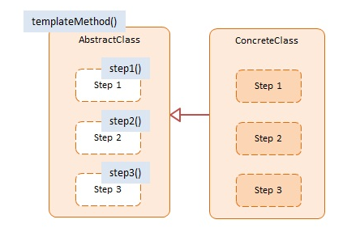
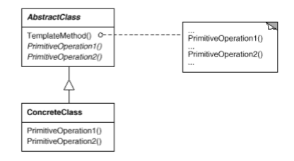

# Template Method

### Intent

Define the skeleton of an algorithm in an operation, deferring some steps to subclasses. Template Method lets subclasses redefine certain steps of an algorithm without changing the algorithm's structure.

### Applicability

Use the __Template Method__ pattern when:
* Implementing the invariant parts of an algorithm once and leave it up to subclasses to implement the behavior that can vary.
* When common behavior among subclasses should be factored and localized in a common class to avoid duplication.
* To control subclasses extensions. A Template Method can call _Hook Operations_ at specific points, thereby permitting extensions only at those points.

### Motivation

Applications built with the framework can subclass Application and Document to suit specific needs. For example, a drawing application defines DrawApplication and DrawDocument subclasses; a spreadsheet application defines SpreadsheetApplication and SpreadsheetDocument subclasses.  
 

We call OpenDocument a template method. A template method defines an algorithm in terms of abstract operations that subclasses override to provide concrete behavior.

By defining some of the steps of an algorithm using abstract operations, the template method fixes their ordering, but it lets Application and Document subclasses vary those steps to suit their needs.

### Structure

### Consequences

Template methods are a fundamental technique for code reuse. Lead to an inverted control structure: "_Don't call us, we'll call you_". This refers to how a parent class calls the operations of a subclass and not the othey way around.

Template methods call the following kinds of operations:
* Concrete operations.
* Concrete AbstractClass operations.
* Primitive operations.
* Factory Methods.
* __Hook Operations__, which provide default behavior that subclasses can extend if necessary. Often, a Hook Operationes does nothing by default.

It's important for template methods to specify which operations are hooks (may be overridden) and which are abstract operations (must be overridden). To reuse an abstract class effectively, subclass writers must understand which operations are designed for overriding. 