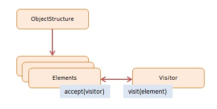
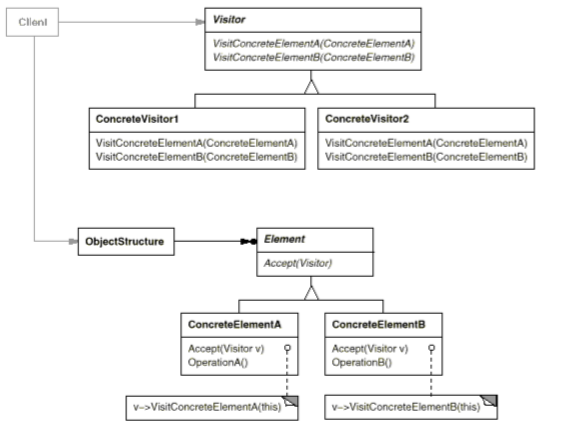
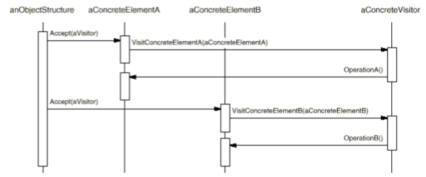

# Visitor

### Intent

Represent an operation to be performed on the elements of an object structure. Visitor lets you define a new operation without changing the classes of the elements on which it operates.

### Applicability

Use the __Visitor__ pattern when:
* An object structure contains many classes of objects with different interfaces, and you want to perform operations on these objects that depend on their concrete classes.
* Many distinct and unrelated operations need to be performed on objects in an object structure, and you want to avoid "polluting" their classes with these operations. Visitor lets you keep related operations together by defining them in one class.
* The classes defining the object structure rarely change, but you often want to define new operations over the structure.

### Motivation

The Visitor pattern defines a new operation to a collection of objects without changing the objects themselves. The new logic resides in a separate object called the Visitor.

Visitors are useful when building extensibility in a library or framework. If the objects in your project provide a 'visit' method that accepts a Visitor object which can make changes to the receiving object then you are providing an easy way for clients to implement future extensions.

### Structure

### Consequences

1. Visitor makes adding new operationes easy.
2. A visitor gathers related operations and separtes unrelated ones.
3. Adding new ConcreteElement classes is hard.
4. Visiting across class hierarchies, you are not restricted to same types of elements as an Iterator.
5. Accumulating state. Visitors can accumulate state as they visit each element.
6. Breaking encapsulation. Visitor 
