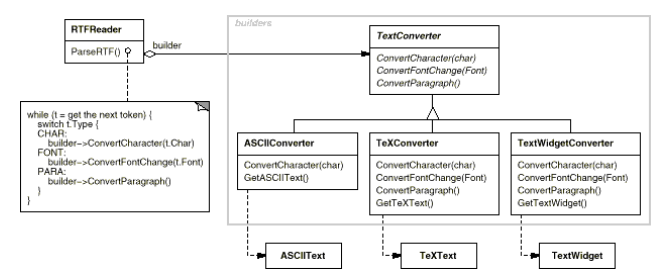
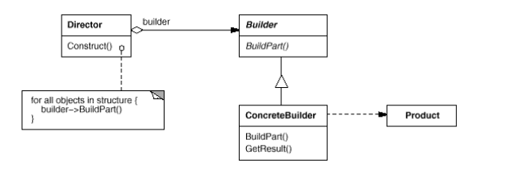
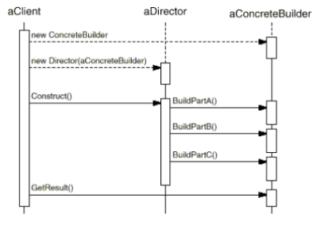

# Builder

### Intent

Separate the construction of a complex object from its representation so that the same
construction process can create different representations.

### Motivation

A reader for RTF (Rich Text Format), should be able to convert RTF
to many text formats. The reader might convert RTF documents into
plain ASCII text or into a text widget that can be edited interactively.
The problem, however, is that the number of possible conversions is
open-ended. So it should be easy to add a new conversion without
modifying the reader.

A solution is to configure the `RTFReader` class with a `TextConverter`
object that converts RTF to another textual representation. Subclasses
of TextConverter takes the mechanism for creating and assembling a complex
object and puts it behind an abstract interface. The converter is separate
from the reader, which is responsible for parsing an RTF document.

Builder pattern captures all these relationships. Each converter class is
called a __builder__ in the pattern, and the reader is called the __director__.

This lets us reuse the RTFReader's parsing algorithm to create different text
representations from RTF documents, by configuring the RTFReader with
different subclasses of TextConverter.

### Applicability

Use the Builder pattern when:

* Algorithm for creating a complex object should be independent of the parts
that make up the object and how they're assembled.
* Construction process must allow different representations for the object
that's constructed.

### Structure

* __Builder__ (`TextConverter`)
    * specifies an abstract interface for creating parts of a Product object.
* __ConcreteBuilder__ (`ASCIIConverter`, `TeXConverter`, `TextWidgetConverter`)
    * constructs and assembles parts of the product by implementing the Builder interface.
    * defines and keeps track of the representation it creates
    * provides an interface for retrieving the product (e.g. `GetASCIIText`).
* __Director__ (`RTFReader`)
    * constructs an object using the Builder interface.
* __Product__ (`ASCIIText`, `TeXText`, `TextWidget`)
    * representation of the complex object under construction. `ConcreteBuilder` builds
    the product's internal representation and defines the process of which it's
    assembled.
    * includes classes that define the constituent parts, including interfaces for
    assembling the parts into the final result.

#### Collaborations
   
* Client creates the Director object and configures it with the desired Builder object.
* Director notifies the Builder whenever a part of the product should be built.
* Builder handles requests from the Director and adds parts to the product.
* Client retrieves the product from the Builder.

### Consequences

1. Vary a product's internal representation defining new kind of builder.
2. Isolates code from construction and representation, improving modularity and encapsulation.
3. Finer control over the construction process, step by step under director's control.
