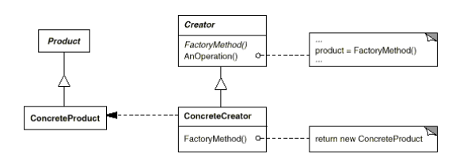

# Factory Method

- [Factory Method](#factory-method)
  - [Intent](#intent)
  - [Applicability](#applicability)
  - [Collaborations](#collaborations)
  - [Consequences](#consequences)
  - [Related Patterns](#related-patterns)
  - [Implementation](#implementation)
  - [Motivation](#motivation)

## Intent

Define an interface for creating an object, but let subclasses decide which class to instantiate. Factory Method lets a class defer instantiation to subclasses.

## Applicability

Use the _Factory Method_ pattern when:

* A class can't anticipate the class of objects it must create.

* A class wants it subclasses to specify the objects it creates.

* Classes delegate responsibility to one of several helper subclasses, and you want to localize the knowledge of which helper subclass is the delegate.

## Collaborations

* `Creator` relies on its subclasses to define the __factory method__ so that it returns an instance of the appropriate `ConcreteProduct`.

## Consequences

1. __Eliminate the need to bind application-specific classes into your code__. The code only deals with the `Product` interface, therefore it can work with any user-defined `ConcreteProduct` classes.

2. __Client might need to need with an extra point of evolution__. Clients might have to subclass `Creator` class just to create a particular `ConcreteProduct` object.

3. __Provides hooks for subclasses__. It gives subclasses a hook for providing an extended version of an object.

4. __Connects parallel class hierarchies__. Parallel class hierarchies result when a class delegates some of its responsibilities to a separate class. 

## Related Patterns

_Abstract Factory_ is often implemented with factory methods.

Factory methods are usually called within _Template Methods_.

_Prototypes_ don't require subclassing `Creator`. However, they often require an `initialize` operation on the `Product` class. `Creator` uses `initialize` for initializing the object. _Factory Method_ doesn't require such an operation.

## Implementation

Consider the following issues when applying the _Factory Method_ pattern:

1. __Two major varieties__.

  * `Creator` is an abstract class and does not provide an implementation for the factory method it declares. This case _requires_ subclasses to define an implementation.

  * `Creator` is a concrete class and provides a default implementation for the factory method. It ensures designers of subclasses can change the class of object their parent class instantiates if necessary.

2. __Parameterized factory methods__. Variation of the pattern that lets the factory method create _multiple_ kind of products by taking a paramater that identifies the kind of objects to create (all share the `Product` interface). Overriding a parameterized factory method lets you easily and selectively extend or change the products that a `Creator` produces. You can introduce new identifiers for new kinds of products, or you can associate existing identifiers with different products.

3. __Language specific variants and issues__.

4. __Using templates to avoid subclassing__. As mentioned, a potential problem is that factory methods might force you to subclass just to create the appropriate `Product` objects. With languages such as C++, you can provide a template subclass of `Creator` that's parameterized by the `Product` class, and with this template, the lcient supplies just the `Product` class and no more subclassing of `Creator` is required.

5. __Naming conventions__. It's a good practice to use naming conventions that make it clear you're using factory methods such as declaring the abstract operation that defines the factory method like `ClassName* DoMakeClassName()`.

## Motivation

Consider a framework for applications that can present multiple documents to the user. Two key abstractions are the abstract classes `Application` and `Document`, and clients have to subclass them to realize their application-specific implementations.

To create a drawing application, for example, we define the classes `DrawingApplication` and `DrawingDocument`. The `Application` class is responsible for managing `Documents` and will create them as required.

Because the particular `Document` subclass to instantiate is application-specific, the `Application` class can't predict the subclass of `Document` to instantiate, the `Application` class only knows _when_ a new document should be created, not _what_ kind of `Document` to create. This creates a __dilemma__: The framework must instantiate classes, but it only knows about abstract classes, which it cannot instantiate.

The _Factory Method_  pattern offers a solution. It encapsulates the knowledge of which `Document` subclass to create and moves this knowledge out of the framework.

Application subclasses redefine an abstract `CreateDocument` operation to return the appropriate `Document` subclass. Once an `Application` subclass is instantiated, it can then instantiate application-specific `Document`s without knowing their class. We call `CreateDocument` a __factory method__ because it's responsible for "manufacturing" an object.

