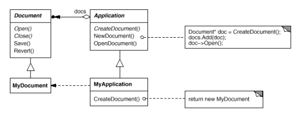
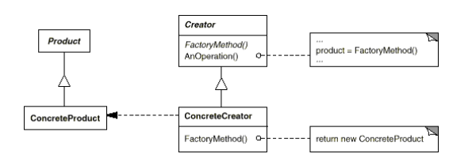

# Factory Method

### Intent

Define an interface for creating an object, but let subclasses decide which class to instantiate.
Factory Method lets a class defer instantiation to subclasses.

### Motivation

Frameworks use abstract classes to define and maintain relationships between objects. A framework
is often responsible for creating these objects as well.

Consider a framework for applications that can present multiple documents to the user.

Two key abstractions in this framework are the classes `Application` and `Document`. Both classes
are abstract, and clients have to subclass them to realize their application-specific implementations.
To create a drawing application, for example, we define the classes `DrawingApplication` and
`DrawingDocument`. The `Application` class is responsible for managing `Documents` and will create them
as required.

Because the particular `Document` subclass to instantiate is application-specific, the `Application`
class can't predict the subclass of `Document` to instantiate, the `Application` class only knows when
a new document should be created, not what kind of `Document` to create.

The Factory Method pattern offers a solution. It encapsulates the knowledge of which `Document` subclass
to create and moves this knowledge out of the framework.

`Application` subclasses redefine an abstract `CreateDocument` operation to return the appropriate
`Document` subclass. Once an `Application` subclass is instantiated, it can then instantiate
application-specific Documents without knowing their class. We call `CreateDocument` a __Factory Method__
because it's responsible for "manufacturing" an object.

### Applicability

Use the Factory Method pattern when:
* Class can't anticipate the class of objects it must create
* Class wants it subclasses to specify the objects it creates
* Class delegates responsibility to one of several helper subclass, and you want
to localize the knowledge of which helper subclass is the delegate

### Structure

* __Product__ (`Document`): defines the interface of objects the factory method creates.
* __ConcreteProduct__ (`MyDocument`): implements the `Product` interface
* __Creator__ (`Application`): declares the factory method, which returns an object of type `Product`.
Creator may also define a default implementation of the Factory Method that returns a default
`ConcreteProduct` object.
* __ConcreteCreator__ (`MyApplication`): overrides the Factory Method to return an instance of a `ConcreteProduct`.

#### Collaborations

`Creator` relies on its subclasses to define the Factory Method so that it returns an instance of the
appropriate `ConcreteProduct`. 

### Consequences

Factory Methods eliminate the need to bind application-specific classes into your code. The code only deals
with the `Product` interface, therefore it can work with any user-defined `ConcreteProduct` classes.

A potential disadvantage is that clients might have to subclass the `Creator` class just to create a particular
`ConcreteProduct` object.

Two additional consequences:

1. __Provides hooks for subclasses__: creating objects inside a class with a Factory Method is always more
flexible than creating an object directly. 

2. __Connects parallel class hierarchies__: Parallel class hierarchies result when a class delegates some of its
responsibilities to a separate class. 
