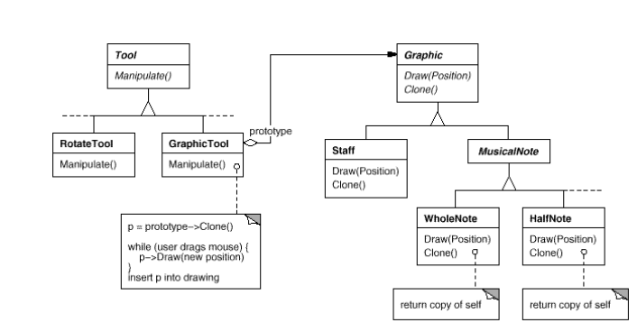
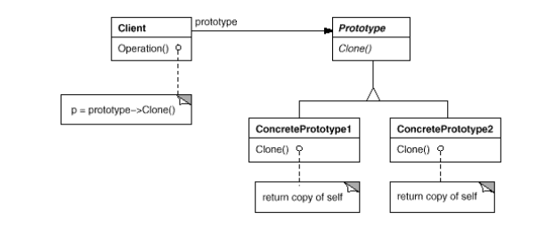

# Prototype

### Intent

Specify the kinds of objects to create using a prototypical instance, and create new objects
by copying this prototype.

### Motivation

You could build an editor for music scores by customizing a general framework for graphical editors
and adding new objects that represent notes, rests, and staves. The editor framework may have 
a palette of tools for adding these music objects to the score. The palette would also include
tools for selecting, moving, and otherwise manipulating music objects.

Let's assume the framework provides an abstract `Graphic` class for graphical components, like notes
and staves. Moreover, it'll provide an abstract `Tool` class for defining tools like those in the
palette. The framework also predefines a `GraphicTool` subclass for tools that create instances of
graphical objects and add them to the document.

But `GraphicTool` presents a problem to the framework designer. The classes for notes and staves are
specific to our application, but the `GraphicTool` class belongs to the framework, so it doesn't know
how to create instances of our music classes to add to the score.

We know object composition is a flexible alternative to subclassing. The question is, how can the
framework use it to parameterize instances of `GraphicTool` by the _class_ of `Graphic` they're
supposed to create?

The solution lies in making `GraphicTool` create a new `Graphic` by copying or "cloning" an instance of
a `Graphic` subclass. We call this instance a __prototype__. `GraphicTool` is parameterized by the
prototype it should clone and add to the document. If all `Graphic` subclasses support a Clone operation,
then the `GraphicTool` can clone any kind of `Graphic`.

So in our music editor, each tool for creating a music object is an instance of `GraphicTool` that's
initialized with a different prototype. Each `GraphicTool` instance will produce a music object by
cloning its prototype and adding the clone to the score.

We can use the Prototype pattern to reduce the number of classes even further. We have separate
classes for whole notes and half notes, but that's probably unnecessary. Instead they could be
instances of the same class initialized with different bitmaps and durations. A tool for creating
whole notes becomes just a `GraphicTool` whose prototype is a `MusicalNote` initialized to be
a whole note. This can reduce the number of classes in a system dramatically. It also makes it
easier to add a new kind of note to the music editor.

### Applicability

Use the Prototype pattern when:

* System should be independent of how its products are created, composed and represented.
* Classes to instantiate are specified at run-time.
* Avoid building a class hierarchy of factories that parallels the class hierarchy of products.
* Instances of a class can have one of only a few different combinations of state.

### Structure

* __Prototype__ (Graphic): declares an interface for cloning itself.
* __ConcretePrototype__ (Staff, WholeNote, HalfNote): implements an operation for cloning itself.
* __Client__ (GraphicTool): creates a new object by asking a prototype to clone itself.

#### Collaborations

A __Client__ asks a __Prototype__ to clone itself.

### Consequences

Similar to __Abstract Factory__ and __Builder__, it hides the concrete product classes from the client,
thereby reducing the number of names clients know about. Moreover, these patterns let a client work wit
application-specific classes without modification.

Additional benefits of the Prototype pattern:

1. _Adding and removing products at run-time_ (simply by registering a prototypical instance with client).
2. _Specifying new objects by varying values_ (define new behavior through object composition instead of new classes).
3. _Specifying new objects by varying structures_.
4. _Reduced subclassing_.
5. _Configuring our application with classes dynamically_.

Notes on 5: An application that wants to create instances of a dynamically loaded classes won't
be able to reference its constructor statically. Instead, the run-time environment creates an instance
of each class automatically when it's loaded, and it registers the instance with a _Prototype Manager_.
Then the application can ask the _Prototype Manager_ for instances of newly loaded classes, that weren't
linked with the program orginally. 

The main __liability__ of the Prototype pattern is that each subclass of Prototype must implement the 
`Clone` operation, which may be difficult, for example when their internals include objects that don't
support copying or have circular references.

### Notes on implementation

Prototype is particularly useful with static languages like C++, where classes are not objects, and little
or no type information is available at run-time. It's less important in languages like Python,
that provides what amounts to a prototype (i.e, a class object) for creating instances of each class. 
This pattern is built into prototype-based languages like Javascript, in which all object creation happens by
cloning a prototype.

#### Using a Prototype Manager

When the number of prototype in a system isn't fixed (can be created/destroyed dynamically),
keep a registry of available prototypes. Clients won't manage prototypes themselves,
but will store and retrieve them from the registry. A client will ask the registry for a prototype
before cloning it.

A Prototype Manager is an associative store that returns the prototype matching a given key. It has
operations for registering a prototype under a key and for unregistering it. Clients can change or
even browse through the registry at runtime.