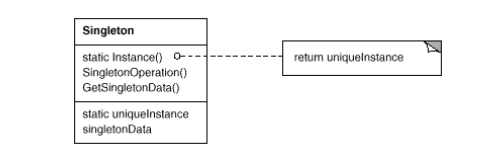

# Singleton

### Intent

Ensure a class only has one instance, and provide a global point of access to it.

### Motivation

It's important for some classes to have exactly one instance. There should be only one file system
and one window manager.

We need to ensure not only that a class has only one instance but also that he instance is easily accessible.

We can make the class itself responsible for keeping track of its sole instance. The class can ensure
that no other instance can be created (by intercepting requests to create new objects), and it can provide
a way to access the instance. This is the Singleton Pattern.

### Applicability

Use the Singleton pattern when:

* There must be exactly one instance of a class, and it must be accessible to clients from a
well-known access point.
* When the sole instance should be extensible by subclassing, and clients should be able to
use an extended instance without modifying their code.

### Structure

* __Singleton__
    * defines an `Instance` operation that lets clients access its unique instance. It is a class
    operation.
    * may be responsible for creating its own unique instance.

#### Collaborations

Clients access a Singleton instance solely through Singleton's `Instance` operation.

### Consequences

Several benefits:
1. Controlled access to sole instance.
2. Permits refinement of operations and representation.
3. Permits a variable number of instance (you can use the same approach to control any number of instances).
4. More flexible than class operations.