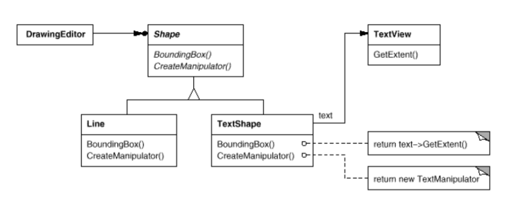
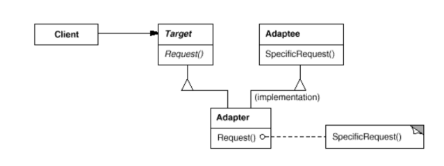
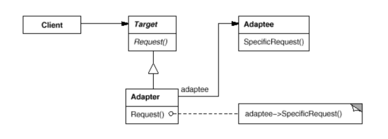

# Adapter

Also known as __Wrapper__.

### Intent

Convert the interface of a class into another interface clients expect. Adapter lets classes work together that couldn't otherwise because of incompatible interfaces.

### Applicability

Use the Adapter when:
* You want to use an existing class, and its interface does not match the one you need.
* You want to create a reusable class that cooperates with unrelated or unforeseen classes that don't necessarily have compatible interfaces.
* (_object adapter only_) You need to use several existing subclasses, but it's impractical to adapt their interface by subclassing every one. An object adapter can adapt the interface to its parent class.

### Motivation

Sometimes a toolkit that's designed for reuse isn't reusable only because its interface doesn't match the domain-specific interface an application requires.

In the following diagram we define a `TextShape` so that it adapts `TextView` interface to `Shape`'s. We can do this in two ways:

1. Inheriting `Shape`'s interface and `TextView`'s implementation.
2. Composing a `TextView` instance within a `TextShape` and implementing `TextShape` in terms of `TextView`'s interface.

These two approaches correspond to the class and object versions of the Adapter pattern. We call `TextShape` an __adapter__.

Often the adapter is responsible for functionality the adapted class doesn't provide.

### Structure

A class adapter uses multiple inheritance to adapt one interface to another:

An object adapter relies on object composition:

### Consequences

1. _How much adapting does Adapter do?_ Adapters vary in the amount of work they do to adapt to the Target interface, from simple
interface conversion to supporting an entirely different set of operations. The amount of work depends on how similar
the Target interface is to Adaptee's.

2. _Pluggable adapters_. A class is more reusable when you minimize the assumptions other classes must take to use it. By
building interface adaption into a class, you eliminate the assumption that other classes see the same interface. This lets us
incorporate our class into existing systems that might expect different interfaces to the class.

3. _Using two-way adapters to provide transparency_. A potentical problem with adapters is that they aren't transparent to all clients. An adapted
object no longer conforms to the Adaptee interface, so it can't be used as is wherever an Adaptee object can. Two-way adapters can provide such transparency.

Class and object adapters have different trade-offs.

#### Class Adapter

* Adapts `Adaptee` to `Target` by committing to a concrete `Adapter` class. As a consequence, a class adapter won't work when we want to adapt a class and all its subclasses.
* Lets `Adapter` override some of `Adaptee's` behavior, since `Adapter` is a subclass of `Adaptee`.
* Introduces only one object, and no additional pointer indirection is needed to get to the adaptee.

#### Object Adapter

* Lets a single `Adapter` work with many `Adaptees` (its subclasses if any). The `Adapter` can also add functioanlity to all `Adaptees` at once.
* Makes it harder to override `Adaptee` behavior. It will require subclassing `Adaptee` and making `Adapter` refer to the subclasses rather than the `Adaptee` itself.