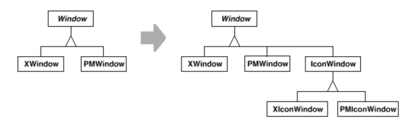
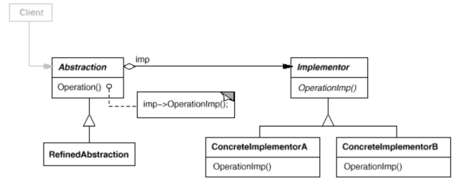

# Bridge

Also known as __Handle/Body__.

### Intent

Decouple an abstraction from its implementation so that the two can vary independently.

### Applicability

Use the __Bridge__ pattern when:
* You want to avoid a permanent binding between an abstraction and its implementation (it can be selected at run-time).
* Both abstractions and their implementations should be extensible by subclassing. Bridge lets you combine different abstractions and implementations, and extend them.
* Changes in implementation of an abstraction should have no impact on clients.
* You want to hide the implementation of an abstraction completely from clients.
* You want to share an implementation among multiple objects, and this fact should be hidden from the client.

The __Adapter__ pattern is geared toward making unrelated classes work together. It is usually applied to systems after they're designed. __Bridge__ on the other hand, is used upfront in a design to let abstractions and implementations vary independently.

### Motivation

When an abstraction can have one of several possible implementations, the usual way to accommodate them is to use inheritance. Ab abstract class defines the interface to the abstraction,
and concrete subclasses implement it in different ways. But this approach isn't always flexible enough. Inheritance binds an implementation to the abstraction permanently, which makes it
difficult to modify, extend, and reuse abstractions and implementations independently.

Bridge pattern addresses these by putting the implementation and abstraction in separate class hierarchies.

#### Problem Example

Consider the implementation of a portable Window abstraction in a user interface
toolkit. This abstraction should enable us to write applications that work on both the X
Window System and IBM's Presentation Manager (PM), for example. Using
inheritance, we could define an abstract class Window and subclasses XWindow and
PMWindow that implement the Window interface for the different platforms. But this
approach has two drawbacks.

1. It's inconvenient to extend the Window abstraction to cover different kinds of
windows or new platforms. Imagine an IconWindow subclass of Window that
specializes the Window abstraction for icons. To support IconWindows for both
platforms, we have to implement two new classes, XIconWindow and
PMIconWindow. Worse, we'll have to define two classes for every kind of
window. Supporting a third platform requires yet another new Window subclass
for every kind of window.

2. It makes client code platform-dependent. Whenever a client creates a window, it
instantiates a concrete class that has a specific implementation. For example,
creating an XWindow object binds the Window abstraction to the X Window implementation, which makes the client code dependent on the X Window
implementation. This, in turn, makes it harder to port the client code to other
platforms.
Clients should be able to create a window without committing to a concrete
implementation. Only the window implementation should depend on the
platform on which the application runs. Therefore client code should instantiate
windows without mentioning specific platforms.

Bridge proposes the following:

### Structure

We can see that `Implementor` will define the interface for implementation classes. The interface doesn't have to correspond exactly to `Abstraction`s interface.
Typically, the `Implementor` provides only primitive operations, and `Abstraction` defines higher-level operations based on these primitives.

### Consequences

1. _Decoupling interface and implementation_: it's even possible for an object to change its implementation at run-time.
2. _Improved extensibility_: You can extend the Abstraction and Implementor hierarchies independently.
3. _Hiding implementation details from clients_.