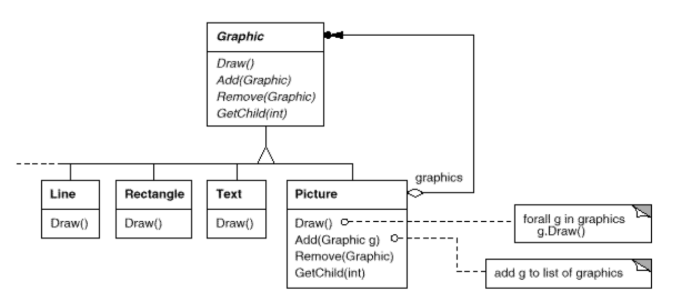
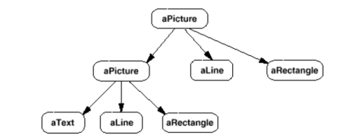
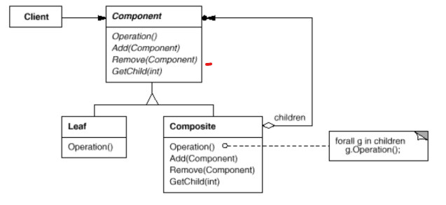
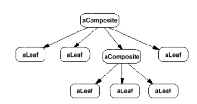

# Composite

### Intent

Compose objects into tree structures to represent part-hole hierarchies. Composite lets clients treat individual objects and compositions of objects uniformly.

### Applicability

Use the __Composite__ pattern when:
* Represent part-whole hierarchies of objects.
* You want clients to be able to ignore the difference between compositions of objects and individual objects.

### Motivation

Graphics applications like drawing editors and schematic capture systems let users build
complex diagrams out of simple components. The user can group components to form
larger components, which in turn can be grouped to form still larger components. A
simple implementation could define classes for graphical primitives such as Text and
Lines plus other classes that act as containers for these primitives.

But there's a problem with this approach: Code that uses these classes must treat
primitive and container objects differently, even if most of the time the user treats them
identically. Having to distinguish these objects makes the application more complex.
The Composite pattern describes how to use recursive composition so that clients don't
have to make this distinction.

The key to the Composite pattern is an abstract class that represents both primitives and
their containers.

The following diagram shows a typical composite object structure of recursively
composed Graphic objects:

### Structure

### Consequences

1. Defines class hierarchies consisting of primitive objects and composite objects. Primitive objects can be composed into more complex objects, and so on recursively. Wherever a client code expects a primitive object, it can also take a composite object.
2. Makes the client simple, being able to treat composite structures and individual objects uniformly.
3. Easier to add new kinds of components. Newly defined Composite/Leaf subclasses work automatically with existing structure and client code.
4. Makes harder to restrict the components of a composite. You can't rely on the type systems to enforce constraints, you'll have to use run-time checks instead.
