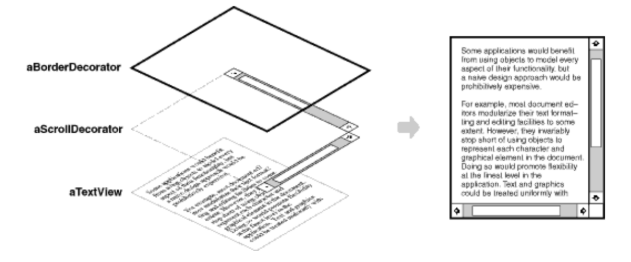
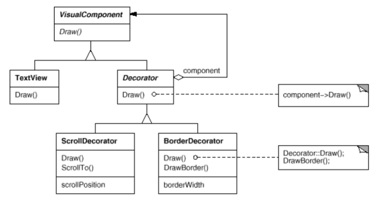
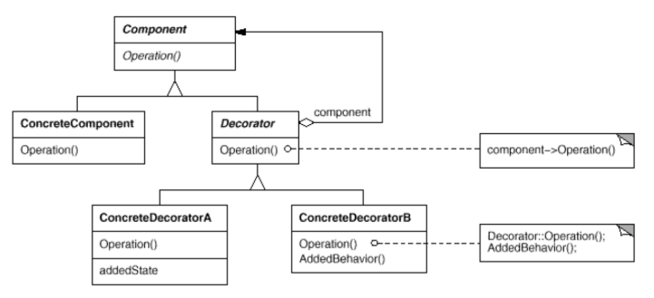

# Decorator

Also known as __Wrapper__.

### Intent

Attach additional responsibilities to an object dynamically. Decorators provide a flexible alternative to subclassing for extending functionality.

### Applicability

Use the __Decorator__ pattern when:
* Add responsibilities to individual objects dynamically and transparently, that is, without affecting other objects.
* For responsibilities that can be withdrawn.
* When extension by subclassing is impractical.

### Motivation

A graphical user interface toolkit, should let you add properties like borders or behaviors like scrolling to any user interface component.

One way to add responsibilities is with inheritance. Inheriting a border from another class puts a border around every subclass instance. This is inflexible, however, because the choice of border is made statically. A client can't control how and when to decorate the component with a border.

A more flexible approach is to enclose the component in another object that adds the border. The enclosing object is called a _decorator_. The decorator conforms to the interface of the component it decorates so that its presence is transparent to the component's clients. The decorator forwards requests to the component and may perform additional actions (such as drawing a border) before or after forwarding. Transparency lets you nest decorators recursively, thereby allowing an unlimited number of added responsibilities.

VisualComponent is the abstract class for visual objects. It defines their drawing and event handling interface. Note how the Decorator class simply forwards draw requests to its component, and how Decorator subclasses can extend this operation. 

Decorator subclasses are free to add operations for specific functionality. For example, ScrollDecorator's ScrollTo operation lets other objects scroll the interface if they know there happens to be a ScrollDecorator object in the interface. The important aspect of this pattern is that it lets decorators appear anywhere a VisualComponent can. That way clients generally can't tell the difference between a decorated component and an undecorated one, and so they don't depend at all on the decoration.

### Structure

Decorator maintains a reference to a Component object and defines an interface that conforms to Component's interface. We then instanciate `ConcreteDecorator`s that add responsibilities to the component.

### Consequences

1. More flexibility that static inheritance. Responsibilities can be added and removed at run-time.
2. Avoids feature-laden classes high up in the hierarchy. Decorators offer a "pay-as-you-go" approach to adding responsibilities. Instead of trying to support all foreseeable features in a complex, customizable class, you can define a simple class and add functionality incrementally with Decorator objects.
3. Decorator and its component aren't identical but decorator acts a transparent enclosure.
4. Lots of little objects.