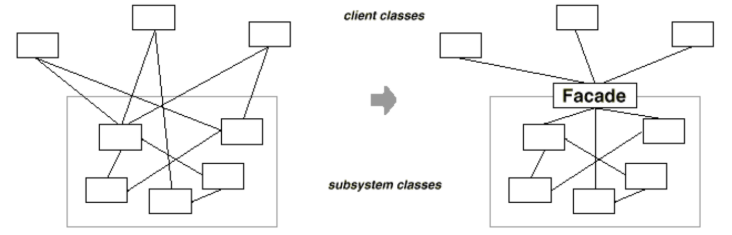
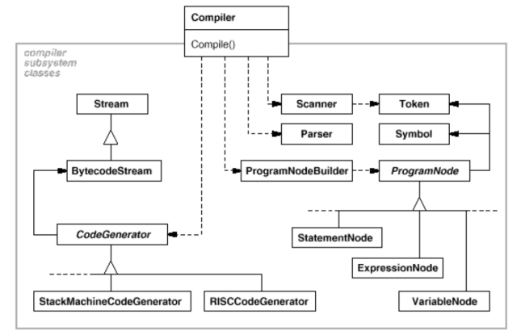
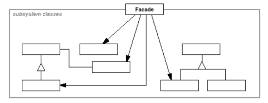

# Decorator

### Intent

Provide a unified interface to a set of interfaces in a subsystem. Facade defines a higher level interface that makes the subsystem easier to use.

### Applicability

Use the __Facade__ pattern when:
* You want to provide a simple interface to a complex subsystem. This makes the subsystem more reusable and easier to customize. 
* There are many dependencies between clients and the implementation classes of an abstraction. Introduce a facade to decouple the subsystem from clients and other subsystems.
* You want to layer your subsystems. Use facade to define an entry point to each subsystem level. If subsystems are dependent, then you can simplify the dependencies between them by making them communicate with each other solely through their facades.

### Motivation

Structuring a system into subsystems helps reduce complexity. A common design goal is to minimize the communication and dependencies between subsystems. One way to achieve this goal is to introduce a facade object that provides a single, simplified interface to the more general facilities of a subsystem.

Consider for example a programming environment that gives applications access to its compiler subsystem. This subsystem contains classes such as Scanner, Parser, ProgramNode, BytecodeStream, and ProgramNodeBuilder that implement the compiler.

Some specialized applications might need to access these classes directly. But most clients of a compiler generally don't care about details like parsing and code generation; they merely want to compile some code. For them, the powerful but low-level interfaces in the compiler subsystem only complicate their task.

To provide a higher-level interface that can shield clients from these classes, the compiler subsystem also includes a Compiler class. This class defines a unified interface to the compiler's functionality. The Compiler class acts as a facade: It offers clients a single, simple interface to the compiler subsystem. It glues together the classes that implement compiler functionality without hiding them completely. The compiler facade makes life easier for most programmers without hiding the lower-level functionality from the few that need it.

### Structure

Decorator maintains a reference to a Component object and defines an interface that conforms to Component's interface. We then instanciate `ConcreteDecorator`s that add responsibilities to the component.

### Consequences

1. More flexibility that static inheritance. Responsibilities can be added and removed at run-time.
2. Avoids feature-laden classes high up in the hierarchy. Decorators offer a "pay-as-you-go" approach to adding responsibilities. Instead of trying to support all foreseeable features in a complex, customizable class, you can define a simple class and add functionality incrementally with Decorator objects.
3. Decorator and its component aren't identical but decorator acts a transparent enclosure.
4. Lots of little objects.