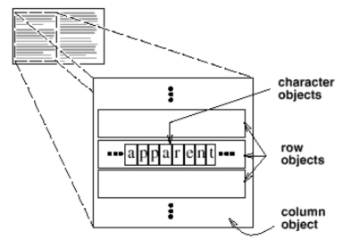
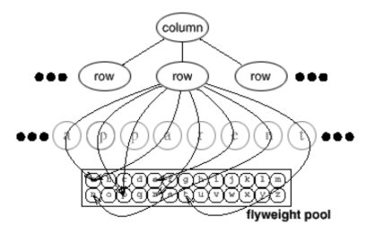
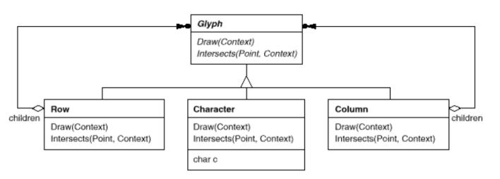
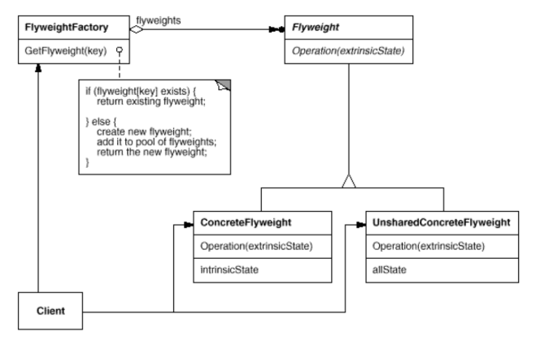
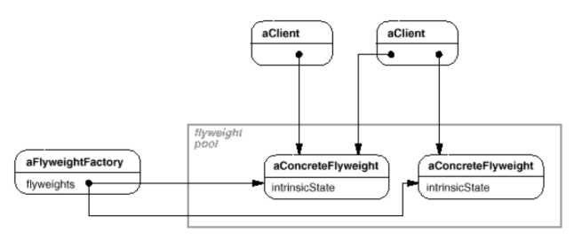

# Flyweight

### Intent

Use sharing to support large numbers of fine-grained objects efficiently.

### Applicability

The __Flyweight__ pattern's effectiveness depends heavily on how and where it's used. Apply the pattern when _all_ of the following are true:
* An application uses a large number of objects.
* Storage costs are high because of the sheer quantity of objects.
* Most object state can be made extrinsic.
* Many groups of objects may be replaced by relatively few shared objects once extrinsic state is removed.
* Application doesn't depend on object identity. Since flyweight objects may be shared, identity tests will return true for conceptually distinct objects.

### Motivation

The application's object structure could mimic the document's physical structure. The following diagram shows how a document editor can use objects to represent characters.

The drawback of such a design is its cost. Even moderate-sized documents may require hundreds of thousands of character objects, which will consume lots of memory and may incur unacceptable run-time overhead. The Flyweight pattern describes how to share objects to allow their use at fine granularities without prohibitive cost. 

A flyweight is a shared object that can be used in multiple contexts simultaneously. The flyweight acts as an independent object in each context—it's indistinguishable from an instance of the object that's not shared. Flyweights cannot make assumptions about the context in which they operate. The key concept here is the distinction between intrinsic and extrinsic state. Intrinsic state is stored in the flyweight; it consists of information that's independent of the flyweight's context, thereby making it sharable. Extrinsic state depends on and varies with the flyweight's context and therefore can't be shared. Client objects are responsible for passing extrinsic state to the flyweight when it needs it. 

In previous example, there is one shared flyweight object per character, and it appears in
different contexts in the document structure. Each occurrence of a particular character
object refers to the same instance in the shared pool of flyweight objects.

### Structure

### Consequences

1. May introduce run-time costs associated with transferring, finding, and/or computing extrinsic state.
2. Such costs are offset by space savings, which increases as more flyweights are shared.
    * reduction in total number of instances that comes from sharing
    * amount of intrinsic state per object
    * whether extrinsic state is computed or stored
